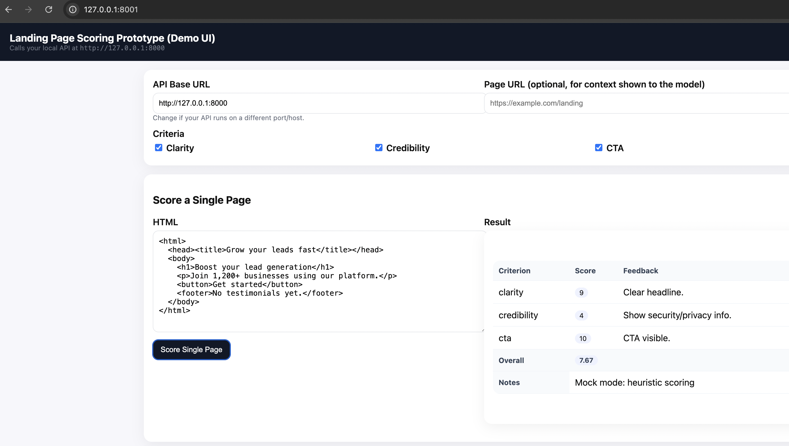
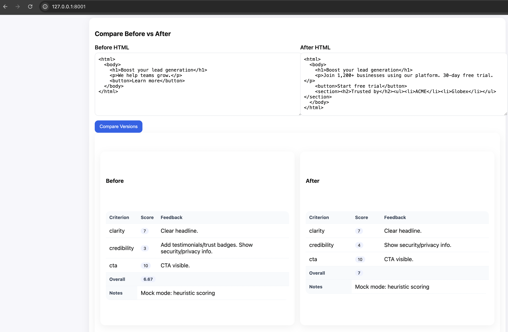
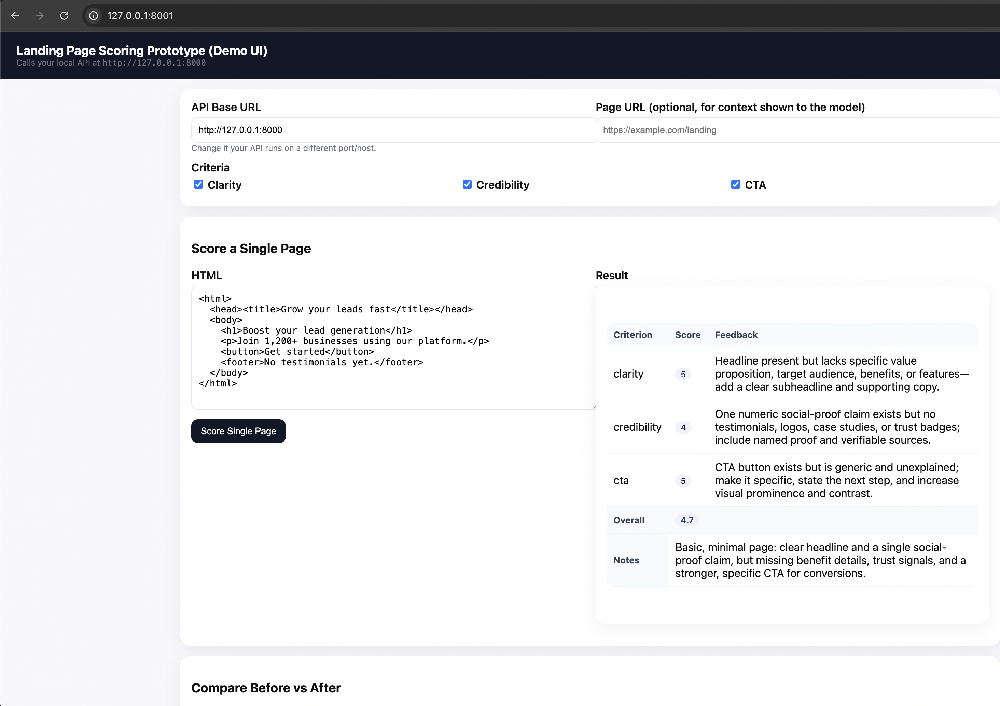
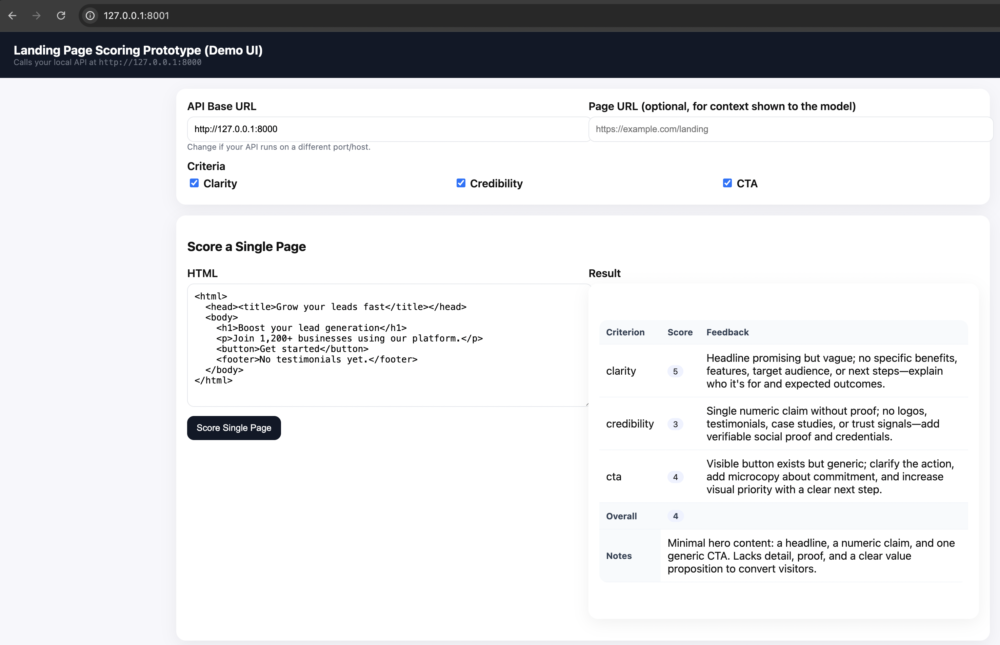
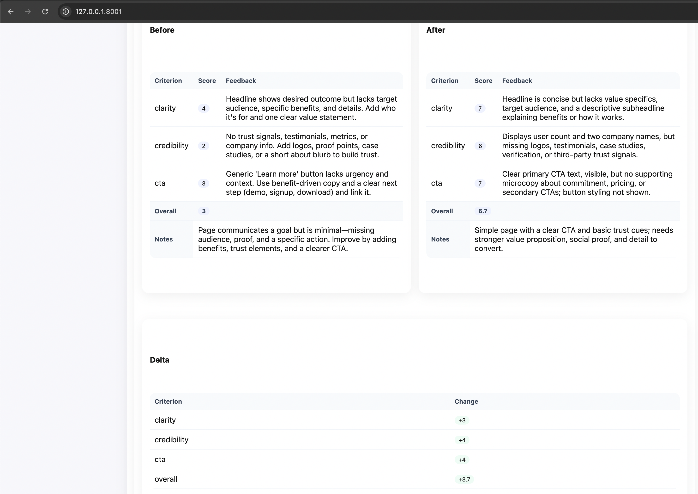

# Landing Page Scoring Prototype

FastAPI + LLM prototype that **analyzes and scores landing pages** on key CRO criteria (clarity, credibility, CTA), and compares **before/after** versions.

- **API**: `POST /score`, `POST /compare`
- **Notebook demo**: run locally or in Colab
- **Tiny UI**: `ui/index.html` (single file) to call the API
- **Mock fallback**: works **without OpenAI credits** (`USE_MOCK=1`)


## Repo structure
```
.
├── app/
│   └── main.py            # FastAPI app (API + mock fallback + CORS), GUI from tiny static server
│   └── main2.py           # FastAPI app (API + mock fallback), GUI from FastAPI app (no CORS needed)
├── Presentation/
│   ├── Landing_Page_Scoring_Tool_First_Text_Simulation.pdf
│   ├── MVP_Landing_Page_Scoring_Tool.pdf
├── docs/
│   └── CORS_Addendum.md
├── notebooks/
│   └── Landing_Page_Scoring_Prototype.ipynb
├── ui/
│   └── index.html         # Single-page UI to hit the API
├── .env.example
├── .gitignore
├── LICENSE
├── requirements.txt
└── README.md
```

## Quickstart (local), preliminary for both Option A & B

```bash
# 1) Create a venv
python3 -m venv .venv
# Windows: .\.venv\Scripts\Activate.ps1
# macOS/Linux:
source .venv/bin/activate

# 2) Install deps
pip install -r requirements.txt

# 3) Environment
# Edit .env from .env.example and set OPENAI_API_KEY (or USE_MOCK=1)
# cp .env.example .env
```


## Option A — Quick (serve GUI on a tiny static server)

1. Run the API (terminal #1, from the project root):

```bash
# 4) Run API (localhost:8000)
uvicorn app.main:app --reload
```


2. Test then serve the GUI (terminal #2, from the project root):

```bash
# 5) Sanity check
curl -s http://127.0.0.1:8000/healthz

```
3. Now, to run the GUI, just send and hook it to FastAPI server.

```bash
python3 -m http.server 8001 --directory ui
```

Displaying the project's html interface at `ui/index.html`, targetting `/score` and `/compare` via the **API Base URL** field. 

4. Open **[http://127.0.0.1:8001](http://127.0.0.1:8001)** in the browser.
   Ensure the **API Base URL** field is `http://127.0.0.1:8000` (default) → click **Score** / **Compare**.


### CORS

FastAPI includes CORS for `127.0.0.1:8001`, so cross-origin calls from the GUI to the API are allowed. 
If you changed ports, add that origin to `CORSMiddleware` in `app/main.py`.

---


## Option B — Serve the GUI from FastAPI (no CORS needed)

This mounts the UI on the **same** origin as the API.

1. Install static files helper:

```bash
pip install aiofiles
```


2. Run:

```bash
uvicorn app.main2:app --reload
```

1. Run the GUI

```bash
python3 -m http.server 8001 --directory ui
```

4. Open **[http://127.0.0.1:8000](http://127.0.0.1:8000)**.
   In the UI, keep **API Base URL** as `http://127.0.0.1:8000` (or change the script to use `window.location.origin` as default).

---

## Troubleshooting

* **CORS error in console** (only Option A):
  Add your UI origin to `allow_origins` in `CORSMiddleware` (e.g., `http://127.0.0.1:8001`).
* **500 from /score** with OpenAI quota messages:
  Use mock mode: set `USE_MOCK=1` in `.env` and restart `uvicorn`.
* **Nothing happens / “Scoring…” forever**:
  Open the browser devtools → Console & Network tabs. Check the request to `/score` or `/compare` for status/headers.
* If you want to check your API key, run this command in the `.venv`:
`python3 -c "import openai, sys; print('openai', openai.__version__); print(sys.executable)"`


Open the UI (static file) by just **double-clicking** `ui/index.html`, or serve it:

```bash
python3 -m http.server 8001 --directory ui
# Then open http://127.0.0.1:8001
```

Set **API Base URL** in the UI to `http://127.0.0.1:8000` (if different).


### Endpoints
**POST /score**
```json
{
  "html": "<html>...</html>",
  "url": "https://example.com",
  "criteria": ["clarity", "credibility", "cta"]
}
```
**POST /compare**
```json
{
  "before_html": "<html>...</html>",
  "after_html": "<html>...</html>",
  "url": "https://example.com",
  "criteria": ["clarity", "credibility", "cta"]
}
```

## GUI Demo screenshots

### 1. Mock mode





### 2. API key Mode








## Mock mode (no credits required)
Set `USE_MOCK=1` in `.env` to use a **heuristic** scorer (deterministic). When a valid key is present, the app calls OpenAI and returns JSON results with model feedback.

## Run the Notebook (optional)
Open `notebooks/Landing_Page_Scoring_Prototype.ipynb` in VS Code or Jupyter. It can start the API inside the notebook and call it with test cells. 
In Colab, install deps in a cell:
```python
!pip -q install fastapi uvicorn pydantic "openai>=1.0.0" nest_asyncio requests python-dotenv
```
## About the landing page url and fetching its html

1.API Base URL
Where the browser should send requests (the FastAPI server). Local demo: http://127.0.0.1:8000
Cloud/ngrok: paste that public URL here. This value tells the GUI where to call /score and /compare.

1. Page URL (optional, for context)
This is the URL of the landing page you’re analyzing. In the current setup it’s context only:
It is passed through to the API and included in the LLM prompt so the model can “see” the page’s address (brand/domain/locale cues).
It does not fetch the HTML. The analysis uses the HTML you paste into the textarea(s).
In mock mode (USE_MOCK=1), the URL is effectively ignored (heuristic uses only the HTML).

1. How to use the Page URL field (today)
If you’re analyzing a live site, paste the public URL here and paste the page’s HTML into the HTML box.
If you’re analyzing a staging page / snippet / Figma export, just leave it blank (or put a label URL), and paste the HTML you want scored.
For before/after comparisons, you can put the same URL (if it’s one page with two versions) or leave it blank—it’s only a label for the model.

1. Common pitfall
Expecting the tool to crawl the URL automatically. By default, it doesn’t. You must paste the HTML (or add the “auto-fetch” extension below).

## License
MIT
